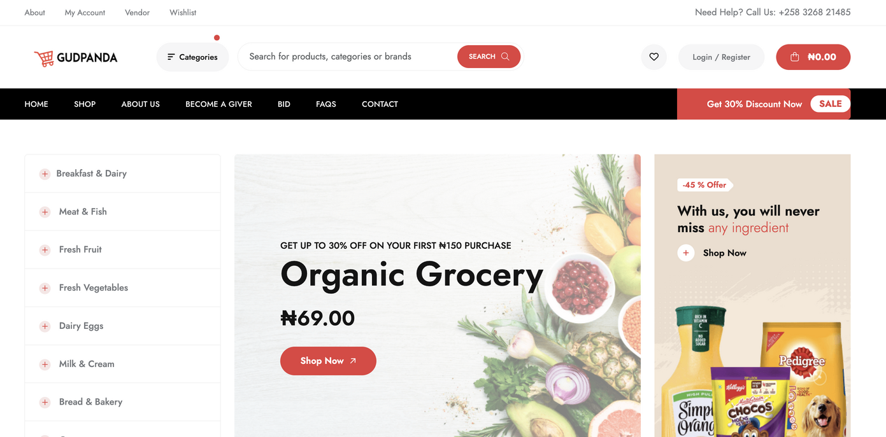

# GudPanda - E-commerce Laravel Project



GudPanda is a feature-rich e-commerce platform built using Laravel. It provides seamless navigation and robust functionality to ensure a smooth shopping experience for customers. This project includes features such as product categorization, product search, a vendor dashboard, wishlist, and much more.

## Features

1. **Product Categories**:
   - Organized navigation for product categories like Breakfast & Dairy, Meat & Fish, Fresh Vegetables, and more.

2. **Search Functionality**:
   - A powerful search bar to find products, categories, and brands easily.

3. **User-Friendly Interface**:
   - Responsive design and smooth navigation.

4. **User Account Management**:
   - Login/Registration functionality for customers and vendors.

5. **Promotions and Discounts**:
   - Dynamic promotional banners and special offers like "Get 30% Discount Now."

6. **Stock and Refund Options**:
   - Display product stock status and specify if a product is refundable or non-refundable.

7. **Tags and Subcategories**:
   - Each product is associated with tags, categories, and subcategories for better filtering.

8. **Vendor and Admin Dashboards**:
   - Separate management systems for vendors and admins.

9. **Wishlist**:
   - Allow users to save favorite products for later purchase.

10. **Product Images Gallery**:
    - Support for multiple product images.

## Technologies Used

- **Backend**: Laravel Framework
- **Frontend**: Blade Templates, Livewire
- **Database**: MySQL
- **Styling**: Bootstrap, Custom CSS
- **Authentication**: Laravel Breeze

## Installation Guide

1. Clone the repository:
   ```bash
   git clone https://github.com/emmanuel-ochii/gudpanda-ll/gudpanda.git
   ```

2. Navigate to the project directory:
   ```bash
   cd gudpanda
   ```

3. Install dependencies:
   ```bash
   composer install
   npm install
   ```

4. Set up the environment:
   - Duplicate `.env.example` and rename it to `.env`.
   - Update database credentials and other environment variables in the `.env` file.

5. Run database migrations:
   ```bash
   php artisan migrate
   ```

6. Seed the database (optional):
   ```bash
   php artisan db:seed
   ```

7. Compile assets:
   ```bash
   npm run dev
   ```

8. Start the server:
   ```bash
   php artisan serve
   ```

9. Access the application in your browser:
   ```
   http://localhost:8000
   ```

## Folder Structure

- **app**: Contains the core logic of the application.
- **resources/views**: Contains Blade templates for the frontend.
- **public**: Contains assets like images, CSS, and JavaScript files.
- **routes/web.php**: Defines web routes for the application.

## Contributing

Feel free to fork this repository and contribute to enhance the project. Submit a pull request with your proposed changes.

## License

This project is open-source and available under the [MIT License](LICENSE).

## Contact

For further assistance, feel free to reach out at `support@gudpanda.com`.

---

Happy Coding!

